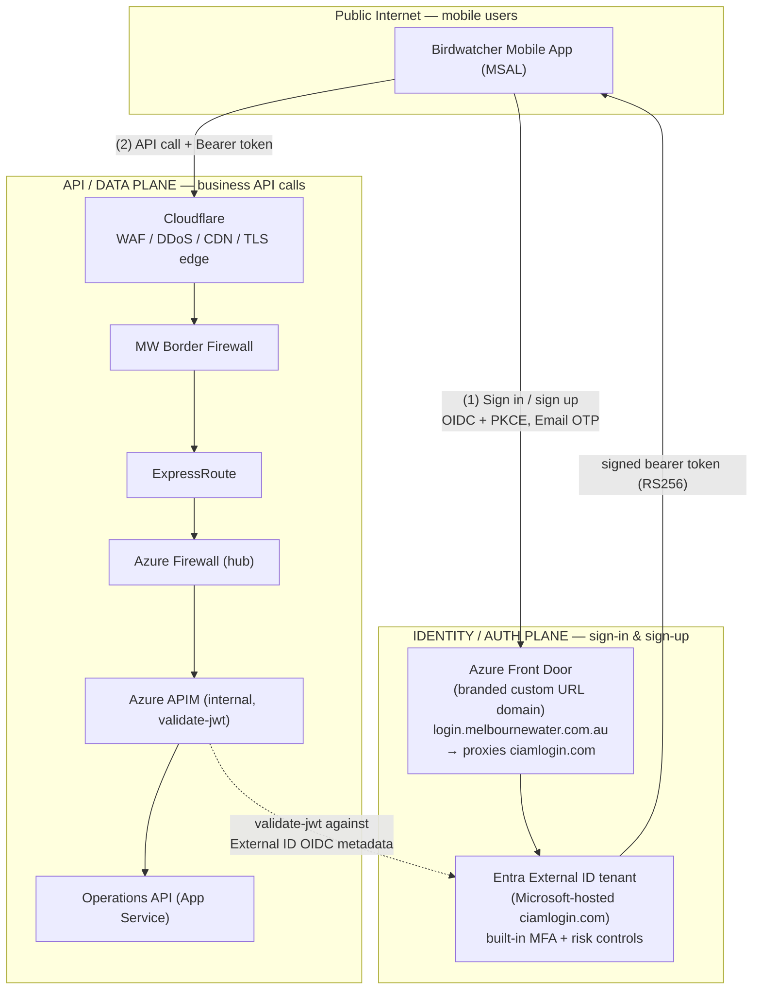

# WTP Birdwatching App — Entra External ID: DevOps & Infrastructure Effort Estimate

**Document Version:** 1.0
**Date:** 25 June 2026
**Author:** AIS / DevOps Team
**Audience:** Project Manager, Architecture Governance, Cybersecurity, MW Platform & Network teams
**Status:** Draft for Review
**Scope:** DevOps & Infrastructure delivery effort for the **Entra External ID (Scenario B)** production deployment — the agreed sole production identity approach.

> **Purpose of this document.** A single, defensible reference you can use to *explain and justify*
> how long it takes our team to **build and test** the WTP Birdwatching platform on Entra External ID.
> It restates the agreed Scenario B scope, adds the **Azure Front Door custom URL domain** change
> required to follow Microsoft's External ID guidance for the **auth (sign-in/sign-up) endpoints**, and
> keeps the existing **Cloudflare WAF** protection for the **API/data path**. Numbers are *realistic*
> (delivery-grade with light contingency), not the aggressive best-case schedule.
>
> **Deliberately kept simple.** Per Microsoft's
> [custom URL domain guidance](https://learn.microsoft.com/en-us/entra/external-id/customers/how-to-custom-url-domain),
> Front Door for the auth endpoint is created with the **WAF/caching settings empty** — and managed
> WAF rules are **not supported** on this endpoint (they cause false positives on sign-in flows). So
> Front Door is just a **branded custom-domain reverse proxy** in front of `ciamlogin.com`. We do not
> re-implement a WAF here; Cloudflare already provides the WAF on the API/data path.

---

## 1. Headline — the number to quote

| Metric | Value |
|--------|-------|
| **Total DevOps/Infra engineering effort (realistic)** | **≈ 68 engineer-days** |
| Build effort | ≈ 48 days |
| Test & validation effort | ≈ 16 days |
| Contingency (governance Q&A, multi-env CR cycles) | ≈ 4 days (~6%) |
| **Team model** | 2 DevOps/Integration engineers working in parallel |
| **Parallelised working time** | ≈ 7 working weeks of hands-on build/test |
| **Realistic calendar — SAD sign-off → Production** | **≈ 10–12 weeks** (gated by firewall CR lead time + External ID provisioning, not by engineering capacity) |

> **One-line justification:** *"The build itself is about seven weeks of two-engineer effort. The
> calendar is 10–12 weeks because two external dependencies sit on the critical path — the 2–4 week
> border-firewall change request and Melbourne Water provisioning the External ID tenant — neither of
> which our engineers can compress."*

---

## 2. Why this is a realistic (not optimistic) estimate

The Scenario B Direct Delivery Plan publishes an **aggressive 54-day Stream A + 4-day Stream B**
best-case schedule. This document is the **realistic** counterpart used for justification:

1. **Adds the Azure Front Door custom URL domain** (≈ 1.5 days) — the simple, Microsoft-documented
   branded-domain proxy for the auth endpoint. Not costed in the aggressive plan.
2. **Adds light contingency** (~6%) for the things that still cost time on regulated infra:
   certificate/DNS handoffs, governance feedback loops, and **separate firewall CRs per environment**
   (Dev, UAT, Prod each carry a 2–4 week lead time).
3. **Keeps engineering line items transparent** — contingency is a single labelled line, not padding
   hidden inside every task, so each task estimate stays easy to defend.

> **What we are *not* doing (scope discipline):** no second/bespoke WAF on the auth endpoint, no
> managed-rule tuning on Front Door (unsupported there), no bot-manager build. Cloudflare WAF on the
> API path plus External ID's own MFA/risk controls cover the security requirement.

---

## 3. Two edges, two jobs — the security model to justify Cloudflare *and* Azure Front Door

This is the part stakeholders most often question: *"Why do we need both Cloudflare and Azure Front
Door?"* Because they protect **two different traffic planes** that meet different requirements.

| | **Auth plane (NEW — Azure Front Door)** | **Data plane (existing — Cloudflare)** |
|---|---|---|
| Protects | Entra External ID hosted **sign-in / sign-up / SSPR** pages | APIM + Operations API business traffic |
| Edge | **Azure Front Door — custom URL domain** (branded proxy) | **Cloudflare** WAF / DDoS / CDN |
| Why this edge | Microsoft's documented pattern to put **our own domain** (`login.melbournewater.com.au`) in front of the Microsoft-hosted `ciamlogin.com` login pages, with Front Door's built-in TLS + DDoS. Created with **WAF/caching empty** — managed WAF rules are **not supported** here. | Already designed; fronts the MW perimeter (border firewall → ExpressRoute → Azure Firewall → APIM). |
| Key controls | Branded custom URL domain, managed TLS, platform DDoS. Account security (MFA, risk, lockout) is handled **by External ID itself**, not by a WAF. | OWASP Core ruleset, DDoS, Authenticated Origin Pulls, origin IP lock |
| Microsoft guidance | [Enable custom URL domains for external tenants (Azure Front Door)](https://learn.microsoft.com/en-us/entra/external-id/customers/how-to-custom-url-domain) | Cloudflare WAF / [Cloudflare IP ranges](https://www.cloudflare.com/ips/) |

> **Justification soundbite:** *"Cloudflare WAF protects the API and can't sit in front of the
> Microsoft-hosted login pages. Microsoft's documented way to brand and front those login pages is a
> simple Azure Front Door custom URL domain — created with WAF/caching empty, because managed WAF
> rules aren't supported on that endpoint. External ID's own MFA and risk controls secure the
> accounts. So it's two lightweight edges, not two WAFs to build and tune."*

---

## 4. What the Azure Front Door custom URL domain involves (the new work)

This is additive to everything already in the delivery plan, but it is **small**. It follows the
Microsoft steps verbatim and can only complete **once the External ID tenant exists**.

| Step | Activity | Owner |
|------|----------|-------|
| 1 | Add + verify the **custom domain name** on the External ID tenant (DNS `TXT` record). | AIS + MW DNS |
| 2 | **Associate** the custom domain name with a **custom URL domain** in the tenant. | AIS (IdAM) |
| 3 | Create the **Azure Front Door** profile/endpoint (origin = `<tenant>.ciamlogin.com`); **Caching and WAF left empty** per Microsoft guidance. Bicep, parameterised per env. | AIS (IaC) |
| 4 | Add the **custom domain + CNAME** on Front Door, validate (TXT `_dnsauth`), associate the route, enable it. Managed TLS certificate. | AIS + MW DNS |
| 5 | Update mobile **MSAL config** + app registration **redirect URIs** to the custom domain. | Web Dev (supported by AIS) |
| 6 | Test: run the user flow through `login.melbournewater.com.au` — sign-up, sign-in, SSPR, token issuance. | AIS + Web Dev |

**Call-outs to justify the (small) time:**
- **No WAF build or tuning here.** Microsoft creates Front Door with WAF/caching empty and states
  managed WAF rules are unsupported on this endpoint. Account security stays with External ID
  (MFA/risk) and Cloudflare WAF stays on the API path.
- Custom-domain TLS + DNS validation involves an **MW DNS handoff** (TXT/CNAME) — minor but not
  instantaneous.
- A **separate Front Door custom domain per environment** (Dev, UAT, Prod) — repeated, but IaC makes
  Prod/UAT near-free after Dev.
- *(Optional, later)* submit a Microsoft support ticket to **block the default `ciamlogin.com`
  domain** once the custom domain is proven — hardening step, not on the build critical path.

---

## 5. Realistic effort breakdown — with per-line justification

> Assumes 2 DevOps/Integration engineers in parallel. **B = build, T = test/validate.**

### 5.1 Infrastructure & edge

| # | Work item | Type | Days | Why it costs this |
|---|-----------|------|------|-------------------|
| 1 | Infrastructure as Code (Bicep): VNet, subnets, NSGs, Azure Firewall policy, APIM, App Service VNet integration + private endpoints, Azure SQL | B | 4.0 | Multi-resource hub/spoke with private networking; parameterised for all envs |
| 2 | **Azure Front Door custom URL domain (build)** | B | 1.0 | AFD profile (WAF/caching empty), origin = `ciamlogin.com`, custom domain + CNAME/TXT, managed cert, route enable. Bicep, per env |
| 3 | **Azure Front Door auth-flow test** | T | 0.5 | Run user flow through the custom domain (sign-up/sign-in/SSPR/token) — no WAF tuning |
| 4 | Cloudflare configuration (data path) | B | 0.5 | DNS proxy, OWASP Core ruleset, Authenticated Origin Pulls, origin IP lock |
| 5 | Border firewall CR preparation (per env) | B | 1.0 | Document Cloudflare IP ranges, ports, ExpressRoute interface, operator path |
| 6 | ExpressRoute gateway configuration (Azure side) | B | 1.0 | VNet Gateway confirm/provision; BGP advertisement of APIM subnet |
| 7 | End-to-end network path smoke test | T | 0.5 | Validate Cloudflare → border FW → ExpressRoute → Azure FW → APIM |

### 5.2 Application & platform

| # | Work item | Type | Days | Why it costs this |
|---|-----------|------|------|-------------------|
| 8 | SQL data schema (data tables only — **no auth tables**) | B | 3.0 | Permits, visits, sightings, hazards, tours, locks, notifications |
| 9 | Operations API (all business endpoints; auth enforced at APIM) | B | 18.0 | Largest single item; full CRUD + operator state transitions + OpenAPI |
| 10 | APIM configuration (routing, `validate-jwt`, rate limiting, Named Values) | B | 3.0 | JWT policy targets External ID OIDC issuer (RS256) |
| 11 | Entra ID — operator app registration, app roles, APIM admin product | B | 2.0 | Internal MW tenant; `WTP.Operator` / `WTP.Admin` roles |
| 12 | CI/CD pipelines — all environments (no Identity API pipeline) | B | 2.0 | IaC, API, Static Web App, DB deploy via managed identity |
| 13 | Notification Hubs integration (APNs + FCM) | B | 2.0 | Shared Services namespace, dev + prod hubs, operator push dispatch |
| 14 | Key Vault + Monitoring/Alerting (App Insights, Log Analytics, alerts) | B | 3.0 | No JWT signing key stored (Microsoft-managed RS256 keys) |

### 5.3 Entra External ID (Stream B)

| # | Work item | Type | Days | Why it costs this |
|---|-----------|------|------|-------------------|
| 15 | External ID tenant configuration: public mobile client registration, API scope, MW branding, Email OTP MFA, user flows | B | 3.0 | Sign-up/sign-in/SSPR/profile-edit flows + custom attributes |
| 16 | APIM `validate-jwt` policy wiring to live External ID OIDC issuer | B | 1.0 | Replace placeholder metadata URL, audience, RS256 |

### 5.4 Test, documentation & contingency

| # | Work item | Type | Days | Why it costs this |
|---|-----------|------|------|-------------------|
| 17 | Integration testing with mobile team (mock tokens → real External ID tokens) | T | 10.0 | Full auth flows + all Operations API calls; bug-fix cycle |
| 18 | UAT and smoke tests | T | 5.0 | Promotion validation across the full path |
| 19 | Documentation and handover | B/T | 4.0 | ADR, API reference, runbooks, CI/CD docs |
| 20 | **Contingency (~6%)** | — | 4.0 | Cert/DNS handoffs, governance Q&A, per-env CR cycles |

### 5.5 Totals

| Group | Days |
|-------|------|
| Infrastructure & edge (incl. Azure Front Door custom URL domain) | 8.5 |
| Application & platform | 33.0 |
| Entra External ID (Stream B) | 4.0 |
| Test, documentation | 19.0 |
| Subtotal | 64.5 |
| Contingency (~6%, rounded) | 4.0* |
| **Total — realistic DevOps/Infra effort** | **≈ 68 engineer-days** |

\* *Contingency expressed as a single line for transparency; ~6% of the engineering subtotal — lower
than a typical buffer because the auth edge is a simple branded domain, not a WAF build/tune.*

> **Production cutover (5 days)** and **Hypercare (10 days)** are calendar phases driven by change
> windows and support rosters, not parallelisable engineering effort, so they are tracked on the
> schedule rather than added to the engineer-day total.

---

## 6. Build vs Test — the split to justify "how long to build and test"

| Phase | Effort (engineer-days) | What it covers |
|-------|------------------------|----------------|
| **Build** | ≈ **48** | IaC, Azure Front Door custom URL domain + Cloudflare edges, Operations API, APIM, Entra (operator + External ID), CI/CD, Notification Hubs, Key Vault, monitoring, docs |
| **Test & validate** | ≈ **16** | Network smoke test, Azure Front Door auth-flow test, integration testing (mobile), UAT |
| **Contingency** | ≈ **4** | Buffer applied across both |

**Plain-English version for a slide or email:**

> *"Build is about **48 engineer-days**; test and validation about **16**. With two engineers that's
> roughly **seven working weeks** of hands-on work. End to end, allow **10–12 weeks** from SAD
> sign-off to production, because the border-firewall change request (2–4 weeks) and Melbourne Water
> provisioning the External ID tenant sit on the critical path and can't be sped up by adding
> engineers."*

---

## 7. Critical-path dependencies (what actually drives the calendar)

| Dependency | Owner | Lead time | Impact if late |
|------------|-------|-----------|----------------|
| SAD sign-off (Architecture + Cybersecurity) | Governance | Hard gate | Blocks all build |
| **Border firewall CR** (per env: Dev, UAT, Prod) | MW Network Team | **2–4 weeks each** | Blocks public network path testing |
| **Entra External ID tenant provisioning** | MW Identity/Platform | Procurement-dependent | Blocks Stream B + Azure Front Door custom URL domain |
| Custom domain DNS + TLS (`login.melbournewater.com.au`) | MW DNS | Days | Blocks Azure Front Door custom-domain go-live |
| Mobile team MSAL integration | Web Dev | Parallel | Blocks end-to-end auth test |

> **Key message:** engineering capacity is **not** the bottleneck. The two items that genuinely set the
> calendar are the **firewall CR lead time** and **External ID provisioning** — both external to our team.

---

## 8. Assumptions

- Two DevOps/Integration engineers available for the duration.
- Existing ExpressRoute circuit with capacity and private peering to the hub VNet (no new circuit).
- App Service EP1 plans and the Shared Services subscription are already available.
- Cyber Security engages promptly on Cloudflare WAF review and External ID branding/MFA/user-flow
  sign-off. (No separate WAF is built on the Front Door auth endpoint — not supported there.)
- Mobile team has capacity to update MSAL redirect URIs to the custom domain in parallel.
- Separate firewall CRs and Front Door custom domains are raised per environment; each carries its
  own lead time but reuses the IaC/templates built for Dev.

---

## 9. References

- WTP Birdwatching — Entra External ID Design & Implementation (`WTP_Birdwatching_ExternalID_Design.md`)
- WTP Birdwatching — Scenario B Direct Delivery Plan (`archive/WTP_Birdwatching_Phased_Auth_Delivery_Plan.md`)
- WTP Birdwatching — External ID Tenant Setup & App Registration CR (`WTP_Birdwatching_ExternalID_Tenant_Setup_CR.md`)
- [Enable custom URL domains for apps in external tenants — Microsoft Entra External ID (Azure Front Door)](https://learn.microsoft.com/en-us/entra/external-id/customers/how-to-custom-url-domain)
- [Plan a CIAM deployment — Microsoft Entra External ID](https://learn.microsoft.com/en-us/entra/external-id/customers/concept-planning-your-solution)
- [Cloudflare IP ranges](https://www.cloudflare.com/ips/)
