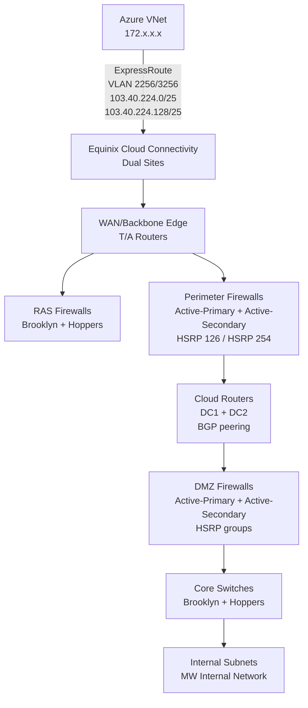

# Melbourne Water DMZ Network Architecture & Azure Connectivity

## Overall Architecture

Melbourne Water runs a **dual data centre, active/active** design across two sites:
- **Brooklyn (DC1)** — primary site (left)
- **Hoppers (DC2)** — secondary site (right)

Both are cross-connected via **Equinix Cloud Connectivity** on each side for resilience.

---

## Network Tiers (Top to Bottom)



---

## Azure ExpressRoute — Does It Hit Both Firewalls?

**Yes**, but with nuance. The path depends on the traffic destination.

### Path 1: Azure → MW Internal (non-DMZ)

```
Azure VNet → FW-ae/FW-ase (Azure Firewall) → ExpressRoute
→ Equinix → WAN Edge
→ Perimeter Firewall (Active-Primary at Brooklyn, Active-Secondary at Hoppers)
→ Cloud Routers (DC1 / DC2)
→ DMZ Firewalls → Core Switches → Internal subnets
```

**Both perimeter AND DMZ firewalls are traversed.**

### Path 2: Azure → DMZ-hosted services

```
Azure → ExpressRoute → Equinix → WAN Edge
→ Perimeter Firewall → Cloud Router
→ DMZ Firewall → DMZ Server VLANs (e.g. 10.248.8.0/24, 10.249.8.0/24)
```

**Traffic terminates in the DMZ — stops at the DMZ firewall.**

---

## ExpressRoute Peering Subnets

| VLAN | Subnet | Site |
|------|--------|------|
| 2256 | `103.40.224.0/25` | Brooklyn (DC1) |
| 3256 | `103.40.224.128/25` | Hoppers (DC2) |

> **Note:** The diagram shows a **Bidirectional NAT-T** entry on the Hoppers perimeter firewall (`103.40.224.150` ext → `10.249.127.240` int), indicating NAT traversal is applied for certain traffic flows.

---

## DMZ Subnet Layout

### Brooklyn (DC1) — 10.248.x.x

| VLAN | Subnet | Gateway | Floating IP | Purpose |
|------|--------|---------|-------------|---------|
| 2001 | 10.248.1.0/24 | 10.248.1.2 | 10.248.1.1 | DMZ Management |
| 2004 | 10.248.4.0/24 | 10.248.4.2 | 10.248.4.1 | DMZ Server VLAN / IDRs |
| 2008 | 10.248.8.0/24 | 10.248.8.2 | 10.248.8.1 | DMZ Server VLAN |
| 2016 | 10.248.16.0/24 | 10.248.16.2 | 10.248.16.1 | NetScaler LB internal |
| 2017 | 10.248.17.0/24 | 10.248.17.2 | 10.248.17.1 | DMZ Server VLAN |
| 2018 | 10.248.18.0/24 | 10.248.18.2 | 10.248.18.1 | DMZ Server VLAN |
| 2021 | 10.248.21.0/24 | 10.248.21.2 | 10.248.21.1 | DMZ Server VLAN |
| 2022 | 10.248.22.0/24 | 10.248.22.2 | 10.248.22.1 | DMZ Server VLAN |
| 2023 | 10.248.23.0/24 | 10.248.23.2 | 10.248.23.1 | DMZ Server VLAN |
| 2024 | 10.248.24.0/24 | 10.248.24.2 | 10.248.24.1 | DMZ Server VLAN |
| 2025 | 10.248.25.0/24 | 10.248.25.2 | 10.248.25.1 | NetScaler LB internal |
| 2026 | 10.248.26.0/24 | 10.248.26.2 | 10.248.26.1 | DMZ Server VLAN |
| 2027 | 10.248.27.0/24 | 10.248.27.2 | 10.248.27.1 | DMZ Server VLAN |
| 2028 | 10.248.28.0/24 | 10.248.28.2 | 10.248.28.1 | DMZ Server VLAN |

### Hoppers (DC2) — 10.249.x.x

| VLAN | Subnet | Gateway | Floating IP | Purpose |
|------|--------|---------|-------------|---------|
| 3001 | 10.249.1.0/24 | 10.249.1.3 | 10.249.1.1 | DMZ Management |
| 3008 | 10.249.8.0/24 | 10.249.8.3 | 10.249.8.1 | DMZ Server VLAN |
| 3016 | 10.249.16.0/24 | 10.249.16.3 | 10.249.16.1 | NetScaler LB internal |
| 3017 | 10.249.17.0/24 | 10.249.17.3 | 10.249.17.1 | DMZ Server VLAN |
| 3018 | 10.249.18.0/24 | 10.249.18.3 | 10.249.18.1 | DMZ Server VLAN |
| 3021 | 10.249.21.0/24 | 10.249.21.3 | 10.249.21.1 | DMZ Server VLAN |
| 3022 | 10.249.22.0/24 | 10.249.22.3 | 10.249.22.1 | DMZ Server VLAN |
| 3023 | 10.249.23.0/24 | 10.249.23.3 | 10.249.23.1 | DMZ Server VLAN |
| 3024 | 10.249.24.0/24 | 10.249.24.3 | 10.249.24.1 | DMZ Server VLAN |
| 3025 | 10.249.25.0/24 | 10.249.25.3 | 10.249.25.1 | NetScaler LB internal |
| 3026 | 10.249.26.0/24 | 10.249.26.3 | 10.249.26.1 | DMZ Server VLAN |
| 3027 | 10.249.27.0/24 | 10.249.27.3 | 10.249.27.1 | DMZ Server VLAN |
| 3028 | 10.249.28.0/24 | 10.249.28.3 | 10.249.28.1 | DMZ Server VLAN |

---

## Perimeter Firewall External Segments (Published Services)

These are on the **perimeter firewalls** facing the internet/Azure side (e.g. for external DNS, RSA auth, mobility):

### Brooklyn Perimeter Firewall Subnets

| Floating IP | Purpose |
|-------------|---------|
| 10.248.144.1 | DC1 EXT UNC APP |
| 10.248.145.1 | DC1 EXT UNC WWW |
| 10.248.152.1 | DC1 EXT INETSRV APP |
| 10.248.153.1 | DC1 EXT INETSRV WWW |
| 10.248.154.1 | DC1 EXT RSA |
| 10.248.160.1 | MW GUEST |
| 10.248.162.1 | DC1 MWCVS WIFI |
| 10.248.164.1 | DC1 MWMOBILITY |
| 10.248.168.1 | DC1 MW JOAN WIFI |
| 10.248.170.1 | DC1 MW VIP WIFI |
| 10.248.224.1 | TCS MPLS |

### Hoppers Perimeter Firewall Subnets

| VLAN | Subnet | Gateway | Floating IP | Purpose |
|------|--------|---------|-------------|---------|
| 3144 | 10.249.144.0/24 | 10.249.144.2 | 10.249.144.1 | EXT UNC APP |
| 3145 | 10.249.145.0/24 | 10.249.145.2 | 10.249.145.1 | EXT UNC WWW |
| 3152 | 10.249.152.0/24 | 10.249.152.2 | 10.249.152.1 | EXT INETSRV APP |
| 3153 | 10.249.153.0/24 | 10.249.153.2 | 10.249.153.1 | EXT INETSRV WWW |
| 3154 | 10.249.154.0/24 | 10.249.154.2 | 10.249.154.1 | EXT RSA |
| 3164 | 10.249.164.0/22 | 10.249.164.2 | 10.249.164.1 | MWMOBILITY |

---

## Azure Side Firewalls (in Azure)

From the firewall documentation, Azure has its own hub firewalls in a hub-and-spoke topology:

| Firewall | Region | Network Rule Collections | Application Rule Collections | Primary Use |
|----------|--------|------------------------|------------------------------|-------------|
| FW-ae | Australia East | 20 | 14 | Financial services, monitoring, data platform |
| FW-ase | Australia Southeast | 70 | 20 | AIS/BizTalk, AD replication, SOC/security tools |

Traffic from Azure VNets (`172.x.x.x`) to on-prem (`10.x.x.x`) is inspected by these **before** hitting the ExpressRoute — meaning traffic is **double-firewalled**: once in Azure (FW-ae/FW-ase) and once at the on-prem perimeter.

---

## End-to-End Traffic Flow Summary

| Layer | Device | Traffic Inspection |
|-------|--------|-------------------|
| Azure side | FW-ae / FW-ase (Azure Firewall) | Azure VNet egress/ingress |
| ExpressRoute peering | BGP via 103.40.224.0/25 + /128 | Equinix cross-connect |
| On-prem edge | Perimeter Firewalls (Active/Active HA, HSRP) | External → internal boundary |
| DMZ tier | DMZ Firewalls (Active/Active HA, HSRP) | DMZ ↔ internal boundary |
| Internal | Core Switches → internal VLANs | Routed internally |

---

## Key Design Observations

- **Active/Active HA** across both sites — no single point of failure at any firewall tier
- **HSRP floating IPs** used for transparent failover on all firewall pairs
- **Bidirectional NAT-T** on Hoppers perimeter firewall for specific ExpressRoute traffic flows
- **NetScaler LB** internal VLANs (2016/3016, 2025/3025) sit behind the DMZ firewalls for load balancing DMZ-hosted services
- **RAS Firewalls** handle remote access / VPN traffic separately from the perimeter path
- Azure traffic traverses **three inspection points**: Azure Firewall → Perimeter Firewall → DMZ Firewall before reaching internal subnets

---

*Source: Melbourne Water DMZ L3 Active/Active diagram — Author: Mithun K, Last Modified: 9-Jun-26, Modified by: Santhosh Nair*
