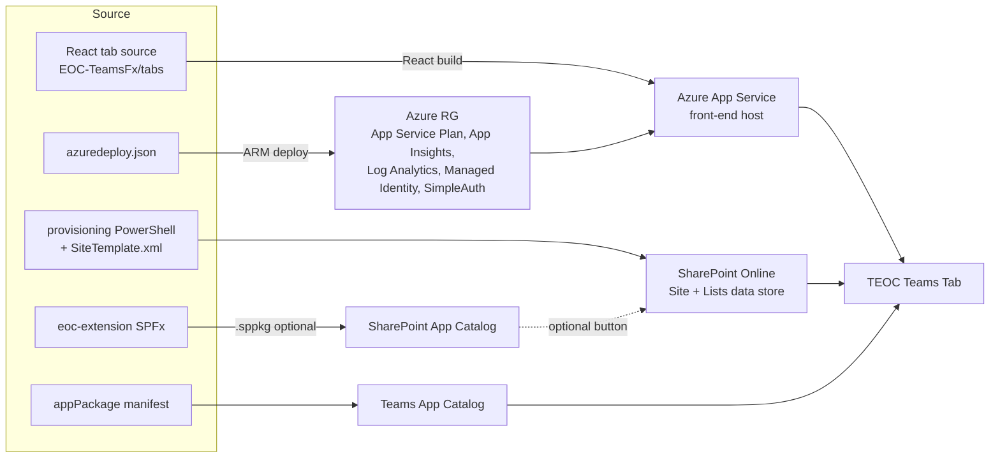

# Microsoft Teams Emergency Operations Center (TEOC) — Solution Review

**Repository:** [OfficeDev/microsoft-teams-emergency-operations-center](https://github.com/OfficeDev/microsoft-teams-emergency-operations-center)
**License:** MIT
**Last release:** v3.4 (27 March 2025)
**Review date:** 25 June 2026
**Status:** ⚠️ Development & support **paused by Microsoft as of 31 March 2025**

---

## 1. What the repository *is*

TEOC is an **open-source Microsoft 365 solution template** (not a single deployable app). It centralizes incident response, information sharing, and field communications on top of native M365 services — Microsoft Teams, SharePoint, Microsoft Lists, and Microsoft Graph. It ships core functionality out of the box and is designed to be extended per agency requirements.

**Language composition:**

| Language | Share |
|---|---|
| TypeScript | 82.9% |
| SCSS | 14.4% |
| PowerShell | 1.3% |
| Bicep | 0.7% |
| HTML | 0.4% |
| Batchfile | 0.3% |

---

## 2. What the repository *does* vs. what it *deploys*

### What the repo does (source / build time)
- Hosts the **React + TypeScript** front-end (a **TeamsFx** Teams tab app, built with Create React App — **not** SPFx).
- Provides **TeamsFx** project scaffolding and configuration for local development and provisioning.
- Contains **ARM templates** (`azuredeploy.json`, `azuredeploygcch.json` for GCC High) to stand up the supporting Azure resources (App Service, App Insights, etc.).
- Contains **PowerShell provisioning** scripts to create SharePoint sites, lists, and columns.
- Packages the **Teams app manifest** + icons into an installable app package.
- Includes **EOC-Extensions**, an *optional* **SPFx** ListView Command Set extension, plus a **Wiki** with deployment guidance.

### What the repo deploys (run time / targets)

> **Important architectural clarification:** TEOC is **not** a SharePoint-hosted SPFx app. The main user interface is a **React (Create React App) Teams tab application hosted on Azure App Service**. SharePoint is used as the **data store** (Microsoft Lists), and the **SharePoint App Catalog** is only used for one *optional* SPFx add-on. Knowing which piece lives where is essential before adopting it.

| # | Component (path) | What it is / what it's for | Build artifact | Deploy target |
|---|---|---|---|---|
| 1 | `EOC-TeamsFx/tabs` | **The front-end UI** — a React/TypeScript single-page app surfaced as a **Teams tab**. This is the dashboard users actually see. | Compiled React build (static JS/CSS) | **Azure App Service** (web app) |
| 2 | `Deployment/azuredeploy*.json` | **The Azure hosting + auth infrastructure** (ARM; commercial + GCC High variants) that the front-end runs on. See breakdown below. | ARM templates | Azure resource group |
| 3 | `Deployment/appPackage` | **The Teams app definition** — manifest + icons that register the app in Teams and point the tab at the App Service URL. | Teams app `.zip` | **Teams admin center** / sideload |
| 4 | `Deployment/provisioning` | **The SharePoint data layer** — PnP PowerShell (`EOC-Provision.ps1`) + site template (`EOC-SiteTemplate.xml`) that create the SharePoint site, **Lists & columns** where incident data is stored. | PowerShell + site template | **SharePoint Online** (site + Lists) |
| 5 | `EOC-Extensions` | **Optional** SPFx **ListView Command Set** ("Notify To Teams Group") — adds a button in SharePoint to post updates to a Teams Announcements channel. SPFx v1.13. | `eoc-extension.sppkg` | **SharePoint App Catalog** |

#### What each deploy target is *for*

- **Azure App Service (front-end host)** — Yes, the front end runs on **Azure App Service**, not SharePoint. The ARM template provisions a **Web App** (`Microsoft.Web/sites`) on an **App Service Plan** (`Microsoft.Web/serverfarms`, Standard/Premium) and pulls the React code in via source-control integration. This is what serves the Teams tab UI.
- **SharePoint App Catalog** — A tenant-level (or site-collection) gallery where **SPFx solution packages (`.sppkg`) are uploaded, trusted, and made available to sites**. In TEOC it hosts **only the optional `eoc-extension.sppkg`** command-set extension — *not* the main app. If you don't need the "Notify to Teams" button, the App Catalog isn't strictly required.
- **SharePoint Online (site + Lists)** — The **data backend**. Microsoft Lists store incidents, roles, tasks, etc. Created/updated by the provisioning PowerShell, not by ARM.
- **Teams admin center** — Where the **Teams app package** is published so users can install the tab org-wide (or sideload for testing).

#### Azure resources provisioned by `azuredeploy.json`

| Azure resource | Type | Purpose |
|---|---|---|
| **App Service (main)** | `Microsoft.Web/sites` | Hosts the React front-end (the Teams tab UI). |
| **App Service Plan** | `Microsoft.Web/serverfarms` (Standard/Premium) | Compute/hosting tier for the web app(s). |
| **SimpleAuth App Service** | `Microsoft.Web/sites` (F1) | Small TeamsFx **auth helper** web app that performs the on-behalf-of token exchange for Graph calls. |
| **Application Insights** | `Microsoft.Insights/components` | Telemetry / monitoring for the front-end. |
| **Log Analytics workspace** | `Microsoft.OperationalInsights/workspaces` | Backing store for App Insights logs. |
| **User-assigned Managed Identity** | `Microsoft.ManagedIdentity/userAssignedIdentities` | Identity used for secure Key Vault / resource references. |

> Note: the **Entra ID (Azure AD) app registration** is created **outside** the ARM template (via the provisioning/registration steps) and its `ClientId`/`ClientSecret` are passed *into* `azuredeploy.json` as parameters — so the auth app is a prerequisite, not an ARM output.

### High-level deployment flow

---

## 3. Existing packages it deploys — and their outdated versions

The front-end (`EOC-TeamsFx/tabs/package.json`) is the largest surface and is the main source of version drift. Notable dependencies pinned at the v3.4 (March 2025) freeze:

| Package | Pinned version | Latest / current status (as of review) | Concern |
|---|---|---|---|
| `react` | ^16.14.0 | React 18/19 GA | **Major** versions behind; React 16 is end-of-life for new features |
| `react-dom` | ^16.14.0 | 18/19 | Tied to React 16 |
| `react-scripts` (CRA) | 5.0.0 | **Create React App is deprecated/unmaintained** | Build tooling abandoned upstream |
| `@microsoft/teams-js` | ^2.21.0 | 2.x newer minors | Teams SDK moves quickly; behind |
| `@microsoft/teamsfx` | 2.1.0 (pinned via overrides) | **TeamsFx superseded by Microsoft 365 Agents Toolkit** | Toolchain rebranded/replaced |
| `@microsoft/teamsfx-react` | ^2.1.1 | newer | Tied to teamsfx 2.x |
| `@fluentui/react` | ^8.117.5 | Fluent UI v9 is current | On the older v8 line |
| `@fluentui/react-northstar` | ^0.62.0 | **Northstar is deprecated** | Dead component library |
| `@microsoft/microsoft-graph-client` | 3.0.1 | newer 3.x | Behind |
| `@microsoft/mgt-react` / `mgt-components` | ^2.10.0 | MGT 4.x | **Major** versions behind |
| `axios` | ^0.21.1 | 1.x | **Pre-1.0; known CVEs in 0.21.x line (SSRF/ReDoS)** |
| `bootstrap` | 5.2.3 | 5.3.x | Minor behind |
| `react-router-dom` | ^5.1.2 | v6/v7 | **Major** versions behind |
| `moment` / `moment-timezone` | ^2.29.4 / >=0.5.35 | **Moment is in maintenance mode (project recommends migrating)** | Legacy date library |
| `typescript` | ^4.1.2 | 5.x | **Major** versions behind |
| `webpack` | ^5.95.0 | 5.x newer | Minor behind |
| `@react-pdf/renderer` | 3.1.12 | 4.x | Major behind |
| `uuid` | ^8.3.2 | 11.x | Major behind |
| `react-table` | ^6.11.5 | v8 (TanStack) | **Major** versions behind; v6 unmaintained |

> The `package.json` already carries a large `resolutions`/`overrides` block (e.g. `nth-check 2.0.1`, `json5 >=2.2.2`, `qs >=6.2.4`, `follow-redirects >=1.14.8`, `jsonwebtoken >=9.0.0`) — these are **manual transitive-dependency security pins**, a strong signal the team was patching known CVEs by hand rather than upgrading the underlying packages. With development paused, that manual patching has stopped.

**Bottom line:** the build chain rests on **deprecated tooling** (Create React App, TeamsFx, Fluent Northstar) and **major-version-behind core libraries** (React 16, TypeScript 4, react-router 5, MGT 2, react-table 6). Any in-house fork must budget for a toolchain modernization before it will reliably build and patch.

---

## 4. Why it's no longer under development

The README carries an official Microsoft notice:

> *"As of 03/31/2025, we will be pausing direct support and feature development for these app templates… We will not be able to respond to support requests submitted via GitHub… No new features or updates will be released."*

### Vendor-staffed signals (commit & contributor history)
- **Contributors (7 total)** are predominantly **Microsoft vendor accounts** — usernames prefixed `v-` (e.g. `v-saikirang`, `v-royavinash`) denote **contractors/vendor staff**, not full-time Microsoft engineers, plus bot/policy-service accounts (`microsoft-github-policy-service[bot]`, `microsoftopensource`).
- The release cadence (9 releases over ~4 years, ending at v3.4) and the cluster of final commits **immediately before the 31 March 2025 pause date** indicate the work was **delivered by a funded vendor engagement that was wound down**.
- Post-pause state: **last meaningful commits ~1 year old**, with **10 open issues** and **24 open pull requests** sitting unmerged — consistent with a project whose staffing/funding was removed rather than a community handover.

**Interpretation:** This is a **program-level wind-down of the OfficeDev app-template catalog**, not a TEOC-specific defect. The MIT license still permits forking, self-hosting, modifying, and redistributing — so an in-house owned fork is fully legitimate, with the caveat (per the README Legal section) that the adopter assumes responsibility for privacy, security compliance, and CVE patching.

---

## 5. Alternative products & solutions

### Microsoft-aligned / same-ecosystem
| Option | What it is | Fit vs. TEOC |
|---|---|---|
| **Self-hosted TEOC fork** | Fork the MIT repo, modernize the toolchain, run it on internal CI/CD | Closest match — preserves existing investment; you own patching |
| **Microsoft 365 + Teams native build** | Recreate incident-response workflows directly with Teams, Lists, Loop, Planner, Power Automate (no SPFx custom app) | Lower maintenance, less custom code; loses the bespoke dashboard UX |
| **Power Platform app** (Power Apps + Dataverse + Power Automate) | Rebuild as a low-code model-driven/canvas app | Easier governance/patching, license cost; redev effort |
| **Microsoft 365 Agents Toolkit / new Teams app templates** | The successor tooling to TeamsFx for building Teams apps | A modern rebuild path rather than a drop-in product |

### Dedicated emergency-management / EOC platforms (COTS)
| Product | Notes |
|---|---|
| **Juvare WebEOC** | Long-established, widely used incident-management / EOC platform (government & healthcare). |
| **Veoci** | Cloud crisis & emergency-management, virtual EOC workflows. |
| **Esri ArcGIS for Emergency Management** | GIS-centric common operating picture / situational awareness. |
| **D4H** | Incident & operations management for emergency response teams. |
| **Noggin** | Integrated resilience, safety & emergency-management platform. |
| **Everbridge** | Critical event management & mass notification. |
| **Microsoft Dynamics 365 (Field Service / custom)** | Can be configured for incident coordination if already invested in Dynamics. |

### Decision guidance
- **Keep & own (fork TEOC):** best if the Teams-native UX and existing data model already fit your processes and you have capacity to modernize/maintain it on CI/CD.
- **Rebuild native/low-code:** best if you want to drop custom front-end maintenance burden and stay fully within supported M365/Power Platform tooling.
- **Buy COTS (WebEOC/Veoci/etc.):** best if you need a vendor-supported, compliance-certified EOC platform and want to exit the custom-maintenance business entirely.

---

## 6. Modernization plan (if adopted by the DevOps team)

This section assumes the decision is **fork & own** — bringing TEOC in-house as a maintained DevOps project rather than rebuilding or buying COTS. The goal is a fork that **builds reliably, patches cleanly, and deploys through our existing `cicdais` CI/CD patterns**.

### 6.1 Guiding principles
- **Own it like a product, not a template** — branch strategy, semantic versioning, release notes, and an SLA for security patches.
- **Stabilize before you modernize** — get a green, reproducible build on the *current* (frozen) code first, then upgrade incrementally behind that safety net.
- **Automate everything that was manual** — the original deploy was interactive (`deploy.cmd`, ARM "deploy to Azure" button with Git source-control integration, Wiki guide). Every step must become a pipeline stage.
- **Security-first** — the manual `resolutions`/`overrides` CVE pinning becomes automated dependency scanning + Dependabot/`npm audit` gates.

> **Architecture reminder (drives the whole plan):** the front-end is a **React (Create React App) web app on Azure App Service** — *not* a SharePoint-hosted SPFx app. So the primary CI/CD work maps onto an **App Service web-app build/deploy** (similar to our Function App patterns), plus ARM→Bicep for the infra, PnP PowerShell for the SharePoint data layer, and a *separate, optional* SPFx pipeline only for the `eoc-extension` command set.

### 6.2 Phased roadmap

| Phase | Theme | Key activities | Exit criteria |
|---|---|---|---|
| **0. Intake & baseline** | Take ownership | Import repo into Azure DevOps (preserve history); strip Microsoft branding/trademarks; record current versions; stand up a build agent with the pinned Node version (the app targets older Node — App Service setting `WEBSITE_NODE_DEFAULT_VERSION` is `16.13.0`) | Repo builds locally & in CI on the *unchanged* code; React build + Teams package produced |
| **1. CI foundation** | Reproducible builds | Add a **`webapp-react-build.yml`** pattern to `cicdais` (React/Node build → static bundle artifact); wire dependency scanning, CodeQL (`javascript`), SBOM, versioning, git tagging | Every PR produces a versioned, scanned artifact |
| **2. CD foundation** | Automated deploy | Add **`webapp-react-deploy.yml`**: deploy the React bundle to **Azure App Service**; ARM→Bicep via existing bicep pattern; idempotent PnP provisioning of the SharePoint site/Lists; Teams app publish; *(optional)* SPFx `.sppkg` → App Catalog; Dev/Test/Prod with approval gates | One-click promotion across environments |
| **3. Toolchain modernization** | De-risk the build | Replace **Create React App / react-scripts** (deprecated) with **Vite**; migrate **TeamsFx → Microsoft 365 Agents Toolkit**; drop **Fluent Northstar** (deprecated); for the optional extension, bump SPFx to a current generator | No deprecated build tooling remains |
| **4. Dependency uplift** | Patchability | Upgrade React 16→18+, TypeScript 4→5, react-router 5→6/7, MGT 2→4, react-table 6→TanStack v8, `axios` 0.21→1.x, replace `moment`; remove obsolete manual `overrides` | All majors current or on a supported line; clean `npm audit` |
| **5. Hardening & handover** | Operability | Add automated tests, telemetry/AppInsights review, runbooks, Dependabot, scheduled patch cadence; document architecture & ownership | On-call-ready; documented patch SLA |

### 6.3 Mapping onto existing `cicdais` patterns

Because the front-end is an **App Service web app**, most of this maps onto patterns we already have (our Function App templates are the closest analogue — same App Service deploy mechanics). The genuinely *new* pieces are a Node/React web-app build and the Teams/SharePoint publish steps.

| Need | Reuse from `cicdais` | New work |
|---|---|---|
| Versioning / build number | `shared/build-version-variables.yml`, `set-build-version.yml` | — |
| Release tagging | `shared/create-git-tag.yml` | — |
| Security scanning + SBOM | pattern from `azure-function-app/dotnet-build.yml` | retarget CodeQL to `javascript` |
| React/Node web-app build | structure of `azure-function-app/*-build.yml` (Node tooling like ADF) | **new `webapp-react-build.yml`** (npm ci → build → bundle artifact) |
| **App Service deploy (front-end)** | deploy mechanics from `azure-function-app/*-deploy.yml` (App Service-based) | **new `webapp-react-deploy.yml`** (AzureWebApp deploy + app settings) |
| Azure resource deploy | `azure-resources-bicep/az-deploy.yml` | convert `azuredeploy.json` → Bicep |
| SharePoint Lists provisioning | *(none — gap)* | PnP PowerShell step, made **idempotent** |
| Teams app publish | *(none — gap)* | CLI for M365 / Graph publish step |
| *(optional)* SPFx extension `.sppkg` | *(none — gap)* | small **SPFx build + App Catalog deploy** (only if the "Notify to Teams" button is wanted) |

> **Net new capability for `cicdais`:** a **React/Node App Service** build+deploy pattern, plus Teams/SharePoint publish helpers. The App Service deploy itself closely mirrors our existing Function App patterns, so the lift is smaller than a pure-SPFx pipeline would be. Everything else is reuse — keeping TEOC on the same versioning, scanning, SBOM, and approval model as the rest of the estate.

### 6.4 Key risks & mitigations

| Risk | Impact | Mitigation |
|---|---|---|
| Old Node version drift blocks compilation | Build won't run at all | Phase 0 pins exact Node (app uses `16.13.0`); modernize to a supported LTS in Phase 3 |
| Deprecated CRA/TeamsFx have no upgrade path | Stuck on dead tooling | Migrate to Vite + M365 Agents Toolkit, not a version bump |
| Service principal lacks Graph/SharePoint/Teams app perms | SharePoint provisioning, App Catalog & Teams publish fail | Provision dedicated SP with SharePoint admin + Teams app + Graph permissions |
| Provisioning scripts not idempotent | Re-runs duplicate lists/columns | Add existence guards before CI use |
| Entra app registration + secret are manual prerequisites | Deploy fails without `ClientId`/`ClientSecret` | Automate app-registration (or pre-create) and store secret in Key Vault; rotate on cadence |
| Ongoing CVE ownership | Security exposure | Dependabot + scheduled patch cadence + audit gate |

### 6.5 Target architecture diagram

> **📌 PLACEHOLDER — draw.io diagram**
> The editable source is at [`TEOC-Modernized-Architecture.drawio`](TEOC-Modernized-Architecture.drawio).
> *(To be exported to an embedded image/Markdown and inserted here later.)*
>
> <!-- TODO: replace this placeholder with the exported diagram, e.g.  -->

---

## 7. Summary

TEOC is a capable, Teams-native emergency operations template, but it is **frozen on a deprecated toolchain** and **no longer staffed** following Microsoft's 31 March 2025 pause of the vendor-built app-template program. Adopting it in-house is viable under MIT, but **requires a deliberate modernization and ongoing patching commitment** — otherwise a native M365/Power Platform rebuild or a COTS EOC platform are the principal alternatives. If adopted, the phased roadmap in Section 6 brings it onto our `cicdais` pipelines with a net-new **React/Node App Service** build/deploy pattern (closely mirroring our existing Function App patterns), Teams/SharePoint publish helpers, and a staged dependency uplift.
